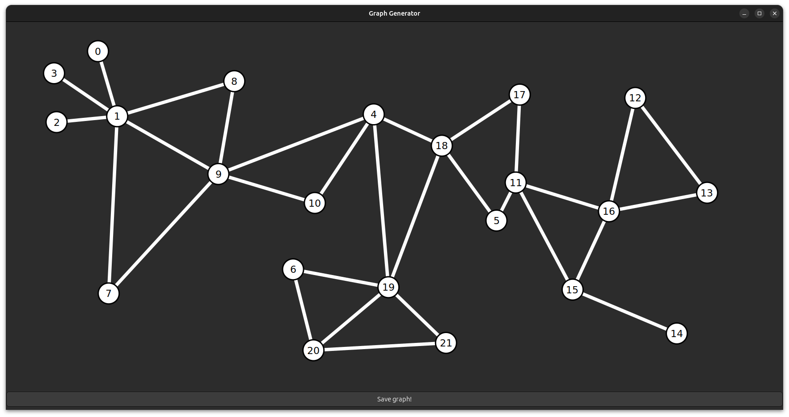

# Graph generator GTK4-rs


## Introduction
A GUI application that allows the user to draw and export graphs.<br>
The tool is meant to be used in order to generate txt files with the following line-by-line structure:
 - Number of vertices
 - Number of edges
 - One line for each vertex ID
 - One line for each edge in the format "vertexID vertexID"

## Usage
Click on the window to create a node.<br>
Click on a node and drag the pointer to the other node you want to connect the first with. An edge will be created between the two nodes.<br>
Click on "Save graph!" button to save the graph in a txt file.

## How to compile
First follow [this](https://gtk-rs.org/gtk4-rs/stable/latest/book/settings.html) guide in order to correctly compile the settings schema according to your OS.<br>
After that, run in the parent folder:

``` cargo run --release``` 